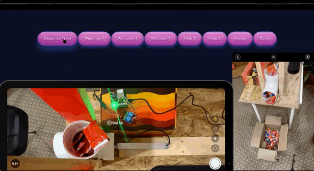

### Project Overview

This year, during Twilio’s internal Solutions Engineering Hackathon, our team set out to do the impossible: save Halloween. We combined Twilio’s programmable communication channels with Electric Imp, our platform for internet connected devices, to create the ultimate candy dispensing robot. 

We settled on a simple robot design to accomplish these goals. It essentially consists of an Electric Imp impExplorer Kit to trigger an electric “pusher” to dispense candy held in a container. 



At a high level, the robot works like this:
- A trick-or-treater approaches the robot and they have two ways to interact:
  - Text a message to a Twilio number, or, 
  - Simply say “trick or treat!”. The robot contains a phone with a long-running PSTN call. An operator listens in using a custom operator dashboard.
- Either of these interactions will send an API request to the Imp
- The Imp endpoint triggers activation of pins 8 and then 9, thus enabling on a relay circuit and powering the linear actuator for a certain amount of time 
  - The movement of the actuator pushes out the candy. 
  - More candy is pushed out for a “treat” than a “trick,” and this can be tweaked in the Imp device code. 
- If the user has texted in, they get a return message of an MMS with a Halloween GIF based on if they’ve gotten a “trick” or a “treat.” 
- If they simply yelled at the speaker on the PSTN call, the operator can use a soundboard to play an MP3 file that is then played through the speaker confirming a “trick” or a “treat” as well as other spooky sounds. 

### Prerequisites
1. Create an Electric Imp account with a Electric Imp Explorer Kit following the steps in the [Imp Getting Started guide](https://developer.electricimp.com/gettingstarted/explorer).
2. Create a Twilio account at https://twilio.com.

### Setup Instructions

First, we recommend reading through [our project blog post](NEED LINK TO BLOG POST HERE) which goes into more detail.

0. Check the blog post above for details on creating and configuring the dispenser if you wish. You can still test the Twilio and Imp code without crafting a dispenser.
1. Copy the ```internetoftreats.device.nut``` code and the ```internetoftreats.agent.nut``` code from the ```/electric_imp``` folder to the respective Agent and Device sections of the Imp Console.
2. Import all 6 of the .js functions from ```/twilio_functions``` to a [Twilio Functions service](https://www.twilio.com/console/functions/overview/services).
	* Update line 17 of ```voice_twiml.js``` function to point to your ```conference_callback.js``` function's public URL. 
	* Add ```axios``` as a dependency to the Function service.
	* Make sure to set all the functions to public.
	* Hit Deploy All after you add all functions and dependencies.
3. Next, we need to create some additional Twilio services: 
	* A) Create [1 Sync Service](https://www.twilio.com/console/sync/services) – set its webhook to point to the public URL of your ```sync_webhook_handler.js``` function. Save this Sync SID for step 4. 
	* B) Create [1 TwiML App](https://www.twilio.com/console/voice/twiml/apps/create) – set the Voice url to point to your ```voice_twiml.js``` function. Save the App SID for Step 4. 
	* C) Create [2 TwiML Bins](https://www.twilio.com/console/twiml-bins/create) – see ```/twilio_bins``` for .xml files. 
		* Update the callback within ```pstn_conference_init.xml``` to point to the URL of your ```conference_callback.js``` function.
	* D) Create [1 API Key](https://www.twilio.com/console/voice/settings/api-keys/create) (Save the API Key SID and API Secret for Step 4)
	* E) Create [1 Phone Number](https://www.twilio.com/console/phone-numbers/search)
4. Return to your [Functions service](https://www.twilio.com/console/functions/overview/services) and add the following environment variables:
	* ```IMP_ID``` is your Imp Agent ID which can be found from https://impcentral.electricimp.com/ide/ and then click on devices. Navigate into your device, and you will see: "Agent ID"
	* ```SYNC_SID``` from Step 3A.
	* ```SYNC_DOC``` set this to "HalloweenDocument" without quotes. 
	* ```TWIML_APPLICATION_SID``` from Step 3B. 
	* ```ANNOUNCEMENTS_BIN_SID``` should point to the SID of the TwiML bin ```conference_announce.xml``` from Step 3C.
	* ```API_KEY``` and ```API_SECRET``` from Step 3D.
5. Create a blank [Studio Flow](https://www.twilio.com/console/studio/flows). 
	* Import ```studioflow.json``` from ```/twilio_studio``` directory. Instructions on how to import a JSON file into Studio are in the "Importing Flows" section here: https://www.twilio.com/docs/studio/user-guide#importing-and-exporting-flows
	* You will need to update the Run Function reference function to point to the ```imp_api.js``` function.
6. Configure your Twilio Phone Number to hit the Studio Flow for Messaging and to hit the TwiML Bin ```pstn_conference_init``` for Voice.
7. YOU DID IT! To activate the dispenser, you can text your Twilio Number. See your Imp in action! Note: If you didn't choose to create a dispenser following our [dedicated blog post](https://docs.google.com/document/d/1fY5S2Kl-1uOMibUPHjaAW9hFMA7fUzi_cV6br8jPc98/edit?usp=sharing), you will still see the ImpCentral logs tell you what "should" be happening!
8. (Advanced) With our web-based operator portal, you can control the dispenser in a real-time voice fashion. The operator portal is a HTML/CSS/JS combo that needs to be hosted somewhere publicly available. Follow the steps below to set it up:
	* Run the following cURL request in terminal to create a Sync Document which will track our Operator Dashboard. Use your Sync SID from Step 3A. 
		* ```curl 'https://sync.twilio.com/v1/Services/[YOUR_SYNC_SID_HERE]/Documents' -X POST --data-urlencode 'UniqueName=HalloweenDocument' -u [YOUR_ACC_SID_HERE]:[YOUR_AUTH_TOKEN_HERE]```
	* Download the ```/operator_dashboard``` folder.
	* In ```index.html```, update the ```halloween.css``` and ```halloween.js``` file paths to where you will have them located. 
	* Update the top of ```halloween.js``` with the public URLs of your ```voice_token.js``` and ```sync_token.js``` functions. (In the Function editor, hit Copy URL to get those.)
	* Upload the three files somewhere publicly accessible (or use a tool like [ngrok](https://ngrok.io))
	* To try it out, visit index.html where you have it hosted. 
	* Then, call your Twilio Number using your phone, enjoy the hold music. 
	* Back on your index.html page, scroll to the bottom of the dashboard and click "Call" to connect the operator.
	* Now from within the Operator Dashboard, you can send the halloween sounds to your phone. We receommend placing the phone hidden by the dispenser, connected to a large bluetooth speaker. You can trigger candy dispensing by using the buttons on the dashboard.

### Thoughts on Scale & Future Advancements
As a matter of practicality, Candybot is not meant to dispense candy to more than one trick-or-treater at a time. (After all, the less candy dispensed, the more left over for you!) However, the capabilities of the Imp scale far beyond the code we built during the hackathon. Many Imps have multiple ports that can be connected to additional circuits and drive more actuators, motors, or other devices. Some Imps can connect to other devices wirelessly, through WiFi or Bluetooth. You can even deploy multiple Imps with the same code to create an Imp farm of massive scale. 

This project makes heavy use of Twilio’s serverless environment. All executions of Studio and Functions therefore are able to scale to meet demand. This means that no matter the load, texts and requests will go through.

In the future, we hope to add additional front-end activation mechanisms on top of text messaging and our Operator Dashboard. Imagine, multiple dispensers set up in parallel automatically reacting by means of Natural Language Processing!? The possibilities are endless. All we know, is that it's time to build. 

### Contributors
Ankit Gupta, Ankur Kumar, Richard Bakare, Patrick Hundal

> Blog post: NEED LINK TO BLOG POST HERE
